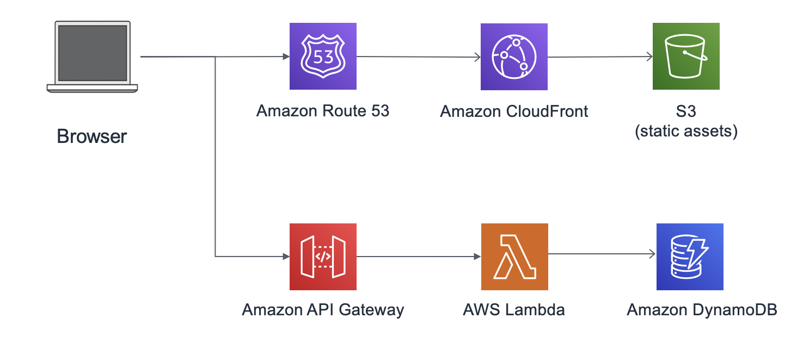
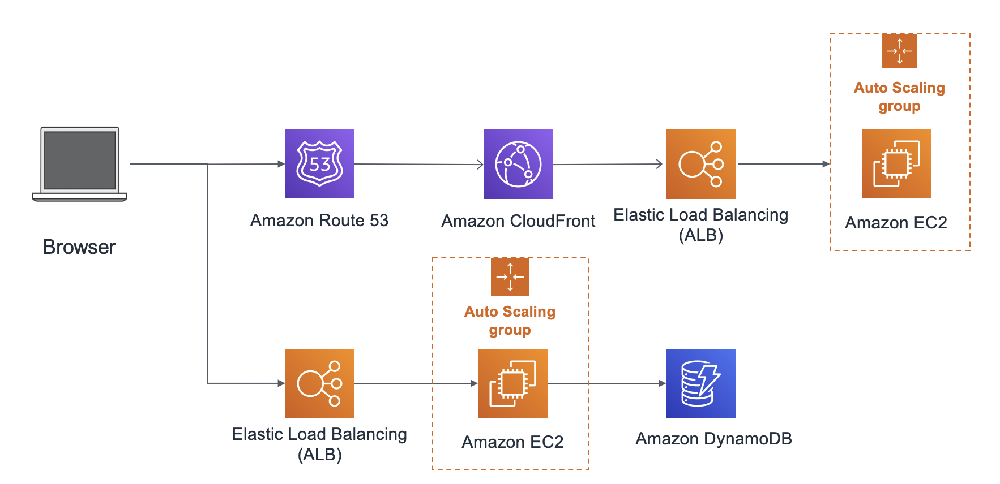
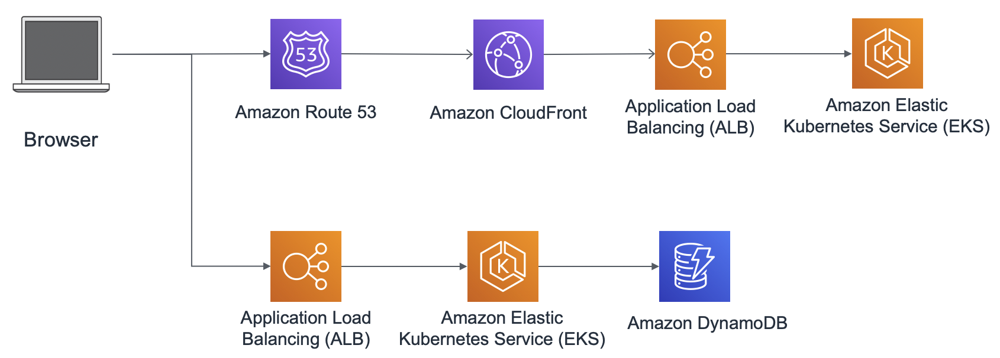

## AWS 中国区：前后端分离 Web Hosting 架构 Terraform 示例代码

**For English version, please kindly check this [README](README.md)**

此 repo 提供三种形式的前后端分离的示例代码，且每种架构部署完后，都提供一个可直接访问的 sample website，以方便测试。
1. Serverless：Cloudfront + S3 / API Gateway + Lambda + DynamoDB
2. EC2: Cloudfront - ALB - EC2 in Auto Scaling Group - DynamoDB
3. EKS: EKS for front and backend

## 前提条件

* 拥有一个主域名做过ICP备案的域名，可以用备案后的二级域名
* 拥有中国区账号，如果您还没有，[点击此处](https://signin.amazonaws.cn/signup?request_type=register)申请 （需要营业执照）
* 部署账号已经打开 80、8080、443的端口。 注：默认是关闭的，需要拥有ICP备案后申请打开。
* 提前申请域名证书，并将域名对应的 SSL 证书上传至 IAM，用于CloudFront 启用 HTTPS

```
# CLI 执行
aws iam upload-server-certificate —server-certificate-name CertificateName
--certificate-body file://public_key_certificate_file —private-key file://privatekey.pem
--certificate-chain file://certificate_chain_file —path /cloudfront/<DistributionName>/
```

## 1.  Serverless Web Hosting

前端 Cloudfront + S3
后端 API Gateway + Lambda

### 架构图



### 部署步骤

1. 下载代码
    ```
    git clone https://github.com/aws-samples/web-hosting-architecture-examples-for-china-region-terraform.git
    cd serverless
    ```

2. 修改 variable.tf  替换域名为自己的变量

    ```
    variable "site_domain" {
      type        = string
      description = "The domain name to use for the static site"
      default = "example.com"
    }
    
    注：如果要改 DynamoDB的名称，需要在 lambda 代码里面也将此值改掉。
    ```

3. 修改 cloudfront.tf ，添加自定义域名 CNAME 和证书

    ```
    # 有SSL证书才能加alias
    aliases = [
         "xxxx.${var.site_domain}"   # 假设域名和证书为 example.com，改为 "xxx.example.com即可"
    ]
    
    viewer_certificate {
       acm_certificate_arn = "xxxxxx"  #证书的ARN
       ssl_support_method  = "sni-only" 
    }
    
    并注释掉：
    # viewer_certificate {
    #    cloudfront_default_certificate = true  #使用默认证书
    # }

    ```

4. (Optional) 如果DNS host zone 已存在，且在本账号中，可以添加下面代码到 cloudfront.tf 中，以便terraform自动添加 Cloudfront CNAME 记录。 

    ```
    # 如果您的 DNS host zone 已经在此 AWS 账号中，并且希望 terraform 帮您添加 cloudfront 域名记录
    # 请添加如下代码：
    
    
    data "aws_route53_zone" "my-domain" {
      name         = "${var.site_domain}"   # host zone名称
      private_zone = false
    }
    
    
    resource "aws_route53_record" "terraform" {
      zone_id = data.aws_route53_zone.my-domain.zone_id
      name    = "terraform.${var.site_domain}"  # 自行修改二级域名
      type    = "A"
      # records = [aws_s3_bucket.site.website_endpoint]
    
      alias {
        name                   = aws_cloudfront_distribution.my-domain.domain_name
        zone_id                = data.aws_route53_zone.my-domain.zone_id
        evaluate_target_health = true
      }
    }
    ```
    
5. 执行 Terraform 脚本

    ```
    terraform init
    terraform apply
    ```

6. 下载前端代码，修改` /tutorial/js/config.js`  中的 `invokeUrl` 为输出的` ``api_gateway_endpoint`

    ```
    # 下载前端代码
    aws s3 sync s3://tiange-s3-web-hosting/unicorn-web-hosting/   tutorial/
    
    # 修改
    window._config = {
        api: {
            invokeUrl: 'xxxxx' // e.g. https://rc7nyt4tql.execute-api.us-west-2.amazonaws.com/prod',
        }
    };
    ```

7. 修改完成后，上传所有静态文件到生成的 S3 bucket 中。 

    ```
    aws s3 sync tutorial/ s3://xxxxx.example.com/
    ```

8. 打开 API Gateway,  找到 /ride 资源， action中，选择 enable CORS，并且重新部署 API
9. （如未在脚本中添加 ROU53 记录）请在自己的 ROUTE 53 zone 中，添加 cloudfront 的 CNAME 记录。将 域名指向 Cloudfront 默认域名 ([xxxx.cloudfront.cn](http://xxxx.cloudfront.cn/))

10. 如需要删除，`terraform destroy` 删除资源

### 验证 & 排错

使用自己的域名、S3 bucket endpoint分别访问，验证是否都可以访问成功。

>注：在中国区，因备案相关要求，无法使用 Cloudfront 默认域名访问 （xxx.cloudfront.cn），此为正常现象。

1. 如果S3 提示404， 检查是否已经上传媒体文件，且这些文件直接存在于 S3 bucket 一级目录下，并没有 ‘tutorial/’ 的层级。如果要添加自己的前缀文件夹，需要修改 cloudfront origin path 。
2. 如果 S3 成功，自己的域名失败，检查证书与 ROUTE53 配置
3. 如果 API Gateway 调用失败，检查是否已经开启 CORS ，且重新部署了 API Gateway

## 2. EC2 as Backend

前端 Cloudfront + ALB + EC2 (Nginx as web server) in Auto Scaling
后端 ALB + EC2 (as app server) in Auto Scaling 

### 架构图


### 部署步骤

1. 下载代码

    ```
    git clone https://github.com/aws-samples/web-hosting-architecture-examples-for-china-region-terraform.git
    cd ec2
    ```

1. 修改 variable.tf  替换域名为自己的变量，包括 `key_name , account_id,  ec2_instance_type，site_domain`。注意，`elb_account_id`，请勿修改。

1. 修改 web-hosting-s3.tf ，添加自定义域名 CNAME 和证书

    ```
    # 有SSL证书才能加alias
    aliases = [
         "xxxx.${var.site_domain}"   # 假设域名和证书为 example.com，改为 "xxx.example.com即可"
    ]
    
    viewer_certificate {
       acm_certificate_arn = "xxxxxx"  #证书的ARN
       ssl_support_method  = "sni-only" 
    }
    
    并注释掉：
    # viewer_certificate {
    #    cloudfront_default_certificate = true  #使用默认证书
    # }
    
    ```

1.  (Optional) 如果DNS host zone 已存在，且在本账号中，可以添加下面代码到 web-hosting-s3.tf 中，以便terraform自动添加 Cloudfront CNAME 记录。 

    ```
    # 如果您的 DNS host zone 已经在此 AWS 账号中，并且希望 terraform 帮您添加 cloudfront 域名记录
    # 请添加如下代码：
    
    
    data "aws_route53_zone" "my-domain" {
      name         = "${var.site_domain}"   # host zone名称
      private_zone = false
    }
    
    
    resource "aws_route53_record" "terraform" {
      zone_id = data.aws_route53_zone.my-domain.zone_id
      name    = "terraform.${var.site_domain}"  # 自行修改二级域名
      type    = "A"
      # records = [aws_s3_bucket.site.website_endpoint]
    
      alias {
        name                   = aws_cloudfront_distribution.my-domain.domain_name
        zone_id                = data.aws_route53_zone.my-domain.zone_id
        evaluate_target_health = true
      }
    }
    ```

1. 执行 Terraform 脚本
    
    ```
    terraform init
    terraform apply
    ```

1. 修改` /tutorial/js/config.js`  中的 `invokeUrl` 为输出的` alb``_url`

    ```
    # 下载前端代码
    aws s3 sync s3://tiange-s3-web-hosting/unicorn-web-hosting/   tutorial/
    
    # 修改
    window._config = {
        api: {
            invokeUrl: 'xxxxx' // e.g. https://test-fsdafsdfssdf.cn-north-1.elb.amazonaws.com.cn:8080',
        }
    };
    ```

1. 修改完成后，上传 JS 文件到 server 上。同时上传到自己的某个 S3 bucket 中，修改 user data，替换` tiange-s3-web-hosting` 为自己的桶，这样往后新的 EC2 会自动拉取更新过的文件。 
    
    ```
    aws s3 sync tutorial/ s3://xxxxx.example.com/
    ```

1. （如未在脚本中添加 ROU53 记录）请在自己的 ROUTE 53 zone 中，添加 cloudfront 的 CNAME 记录。将 域名指向 Cloudfront 默认域名 ([xxxx.cloudfront.cn](http://xxxx.cloudfront.cn/))

1. `terraform destroy` 删除整套资源

## 3. EKS as backed

前端 Cloudfront +  ALB + EKS 
后端 ALB + EKS 

### 架构图



### 前提条件

安装好 [kubectl](https://docs.amazonaws.cn/eks/latest/userguide/install-kubectl.html) 和 [eksctl](https://docs.amazonaws.cn/eks/latest/userguide/eksctl.html) ， 安装并配置[AWS CLI](https://aws.amazon.com/cn/cli/)

### 部署步骤

```
# 下载代码

git clone https://github.com/aws-samples/web-hosting-architecture-examples-for-china-region-terraform.git
cd eks

# terraform
terraform init
terraform apply

# configure kubectl
aws eks --region $(terraform output -raw region) update-kubeconfig --name $(terraform output -raw cluster_name)

# 测试 
kubectl get node

# Deploy Kubernetes Dashboard
kubectl apply -f dashboard-v2.0.0.yaml
kubectl get pods -n kube-system
kubectl get services -n kube-system

 # 部署 ALB ingress controller
 # 参考 https://docs.amazonaws.cn/en_us/eks/latest/userguide/aws-load-balancer-controller.html
 # 北京区的镜像地址为：image.repository=918309763551.dkr.ecr.cn-north-1.amazonaws.com.cn/amazon/aws-load-balancer-controller:v2.4.0

# 部署 sample 应用

# 部署后台
cd ecsdemo-backend
kubectl apply -f ecsdemo-nodejs/deployment.yaml
kubectl apply -f ecsdemo-nodejs/service.yaml

## 检查部署是否正确
kubectl get deployment ecsdemo-nodejs

kubectl apply -f ecsdemo-crystal/deployment.yaml
kubectl apply -f ecsdemo-crystal/service.yaml

## 检查部署是否正确
kubectl get deployment ecsdemo-crystal

# 部署前台, deployment + service + ingress
cd ../ecsdemo-frontend
kubectl apply -f ecsdemo-frontend.yaml

 
## 检查部署是否正确, 或者前端地址
kubectl get deployment ecsdemo-frontend
kubectl get ingress ecsdemo-frontend

# 删除
terraform destroy
```


## 参考资料

* Terraform official documentation ： https://registry.terraform.io/providers/hashicorp/aws/latest/docs
* S3 web hosting : https://learn.hashicorp.com/tutorials/terraform/cloudflare-static-website?in=terraform/aws 
* Serverless web hosting : https://learn.hashicorp.com/tutorials/terraform/lambda-api-gateway?in=terraform/aws
* Cloudfront : https://learn.hashicorp.com/tutorials/terraform/cloudflare-static-website?in=terraform/aws#clone-the-sample-repository 
* EKS workshop: https://github.com/aws-samples/eks-workshop-greater-china/tree/master/china/2020_EKS_Launch_Workshop
* EKS terraform : https://learn.hashicorp.com/tutorials/terraform/eks
* EKS ALB 安装： https://docs.amazonaws.cn/en_us/eks/latest/userguide/aws-load-balancer-controller.html 


## Security

See [CONTRIBUTING](CONTRIBUTING.md#security-issue-notifications) for more information.

## License

This library is licensed under the MIT-0 License. See the LICENSE file.

